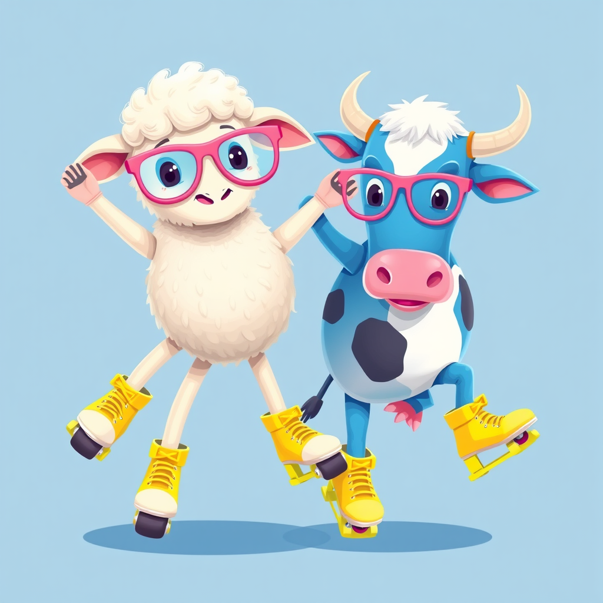

# M20 — Multimodal usage and unified startup

Requirements: MISSION M20; REQ-ENG-004/005/009/011, REQ-INF-012/013,
REQ-FIN-002. Milestone completion still requires the PR's green GitHub `ci`
job and the authorized merge; local checks alone do not establish completion.

## Diagnosed failure and changes

Source: the two original Open WebUI upload files, inspected without publishing
or changing them. Both were 1024x1024. Their sizes were 2,171,727 and 1,253,855
bytes, and the request body was 4,567,689 bytes. The first data URI exceeded
2,796,300 characters: the actual Pydantic error was `string_too_long`.
The adapter incorrectly relabeled every validation failure on a body larger
than 160 KB as `context_exceeded`. This was a byte-limit failure, not token
context exhaustion. The original files remain private; numeric diagnosis is
recorded in BRAIN/m20-diagnosis.json.

Bounded uploads above the 2 MiB provider-image limit are normalized to JPEG,
with dimensions retained and transparency composited onto white. The 6 MiB
HTTP body, 4 MiB aggregate decoded upload, image count and pixel ceilings stay
in force. The strict provider schema and its existing rejection tests remain
unchanged. Normalization is lossy; its original and normalized sizes are logged.
Malformed inputs and numeric limits now have separate diagnostics.

Editing/compositing requests receive an explicit unsupported answer and useful
alternatives. Six editing and six comparison phrasings exercise the public API.
New comparison tests also exposed poor vision answers for featureless images:
exact uniform RGB measurements now supplement vision, without inventing scene
content. Short ambiguous messages fall back to conversation/UI language instead
of unreliable statistical language guesses.

Every generated image carries original request, tool prompt, rewritten prompt,
seed, configured model, resolution and steps into the interaction journal.
Required configuration is validated before startup. Missing worker configuration
is returned through chat with the variable name, with no generation charge.
GPU creation messages follow creation and include the actual instance identifier;
provider failures use sanitized categories rather than raw diagnostics.

## Worker startup and budgets

CONTRADICTION résolue en autonomie: same-request image delivery after cold startup
cannot fit a 120-second wall-clock window: actual startups took **126.36 s** and
**122.90 s**. The existing M13 contract already accounts for initial weight loading
separately. M20 makes that separation explicit: a bounded 900-second loading
window, visible progress and `startup_seconds`, followed by the remaining original
inference allowance. Inference time and money are not reset. No financial limit
was relaxed.

The gateway launches the existing trapped image worker automatically. A
conservative startup reservation is recorded before creation, within the 30 EUR
milestone envelope and 2 EUR/hour ceiling. The experimental instances actually
selected were L4 at 0.7875 EUR/hour excluding storage/IP. Startup reservations
are conservative allowances, not an invoice. The existing automatic shutdown
remains in place. Resource state and cleanup evidence are tracked in BRAIN.

## Image-constraint evidence

Source: a real public-chat generation on 2026-09-15; exact original request is
J24 in tests/journeys/m20-cases.json. The recorded rewrite was:

> Subjects: A five-legged sheep and a blue cow.
> Attributes: Both subjects wear pink glasses and neon yellow roller skates.
> Scene: The sheep and the cow are dancing together.
> Style: Vibrant, whimsical digital illustration with high color saturation.

Seed: **644859752**. Resolution: 1024x1024. Steps: 4. The configured image model
is recorded in the cassette and interaction metadata.

| Constraint | Recorded vision assessment |
|---|---|
| Sheep present | Yes |
| Blue cow | Yes |
| Dancing together | Yes |
| Pink glasses on both | Yes |
| Yellow skates on both | Yes |
| Sheep with five legs | No |

Visual inspection confirms the glasses and skates on both subjects. The sheep
has three skate-bearing lower limbs and two raised forelimbs; five distinct legs
are not clearly demonstrated. This is a conservative failure of the anatomy
constraint. The rewrite preserved it; no model-level counting fix is claimed.

## Verification and scope

J21–J25 were acquired live through the public chat API, including real cold GPU
startup and image retrieval. J26 then exercised a live chat request with missing
LOCAL_MODEL and received a named configuration refusal. Recording acquisition
explicitly reused the earlier recorded prefix for J21–J25 when extending J26.
The committed cassette contains only real exchanges, including startup durations
and the intentional missing-configuration case. CI replays those external
boundaries and still executes the adapter, routing, deadlines and public journeys.
J8 runs two real CPU-stack starts and verifies UI/API readiness, once per unchanged
production fingerprint. Reports distinguish live startup from provider replay.

The existing J1–J20 public journeys remain part of test-journeys. R5 now has a
failing test for missing executable callers, including documented CLI dispatch
through evaluation drivers. The previously standalone M3 harness is mounted
under `/harness` in the chat adapter, retaining its read-only behavior and budgets.

MISSION.md is below 8,000 bytes. Historical definitions and decisions were moved
unchanged to docs/decisions-log.md. No protected workflow, verify script or
CODEOWNERS was changed, and no assertion was weakened. No runtime dependency
was added. The GPU startup script and persistent weight volume are reused.
