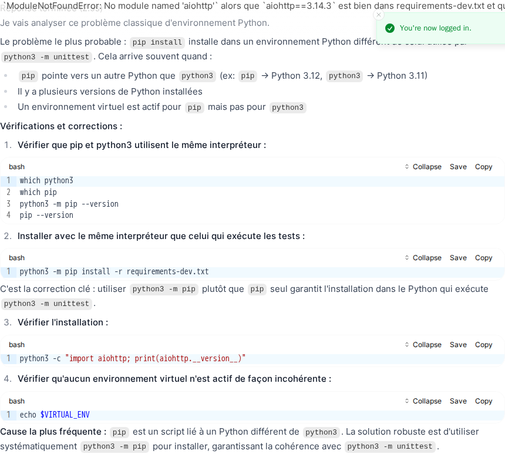
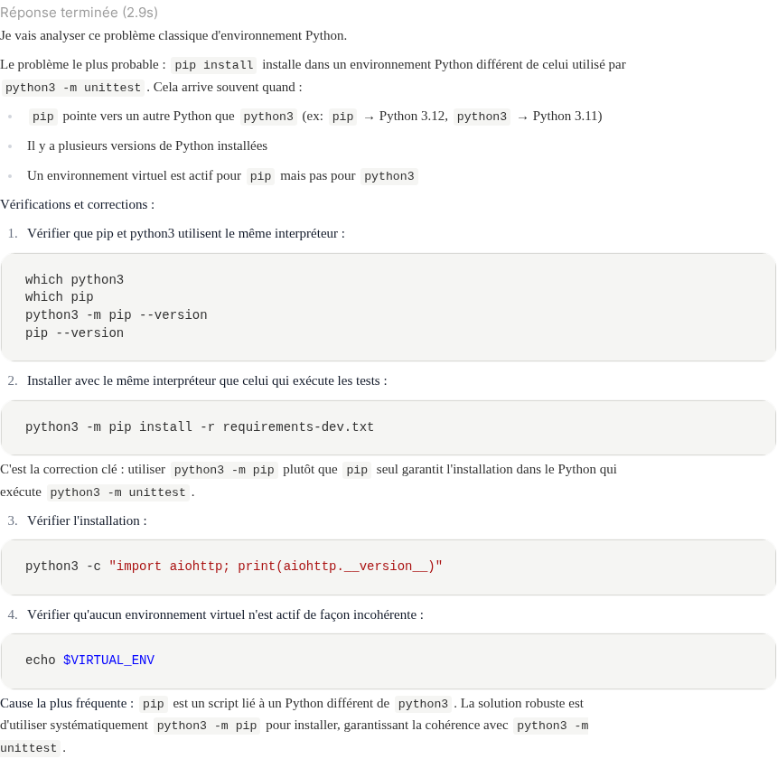
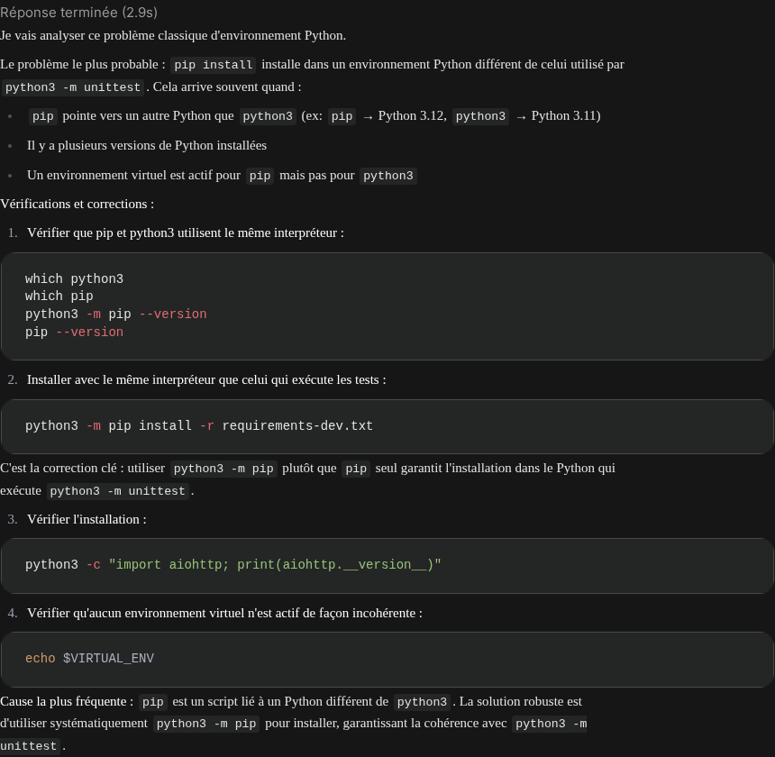
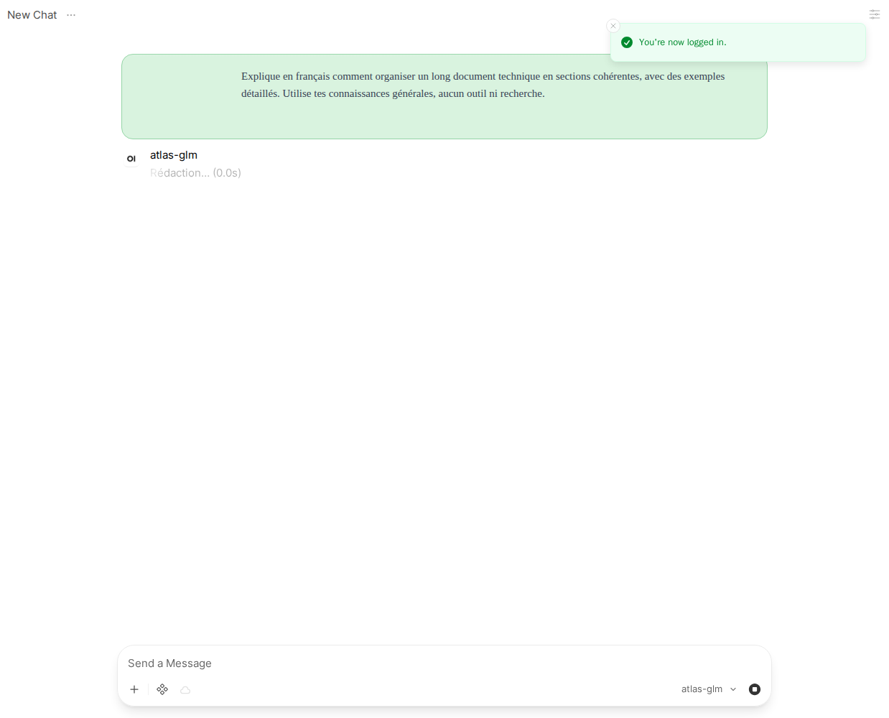
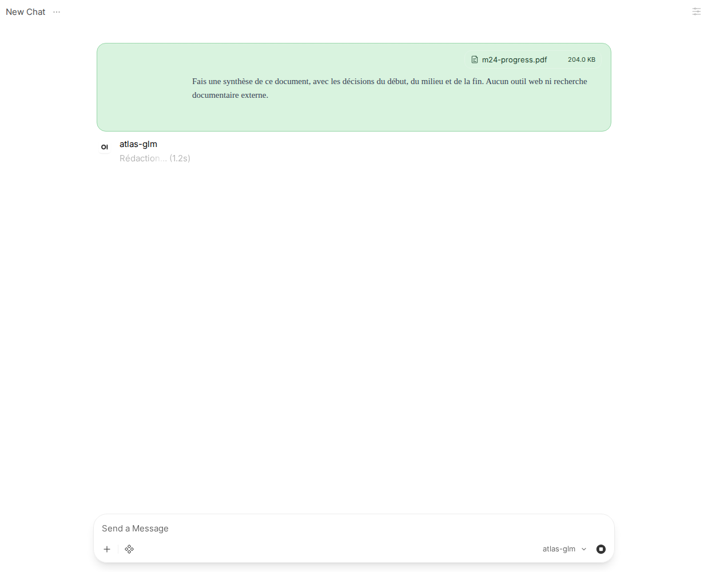

# M24 — Documents, files and visible execution

Status: implementation and live evidence captured; full local gate, implementation
CI and merge remain pending. Contract PR103 was separately merged after
[green contract CI](https://github.com/leag1234/cloclo/actions/runs/35352949576/job/105625346078).
That run does not validate the implementation. REQ-ENG-004/005/009/011, REQ-FIN-002.

## Rendered browser evidence: before and after

Source: actual saved Open WebUI answer in Chromium, not synthetic HTML. The old
stylesheet targeted `.markdown`; this build renders `.markdown-prose` with stable
CodeMirror classes. Before: sans-serif prose, visible line-number gutter and toolbar.
After: Georgia serif,700px paragraphs, no gutter/default toolbar, copy on hover.
No generated Svelte suffix is used. Light/dark computed styles and screenshot
hashes are preserved in `m24-rendering.json` against the exact CSS hash.

## Activity emission, transport and rendering

The original static-cursor failure was not reproduced in two initial live probes.
Native WebSocket status frames and visible named elapsed activity were observed;
the60-page document capture includes elapsed updates from0.2s to1.2s. The code
now retains activity during whitespace-only model output; its regression test
asserts named, unfinished elapsed status until actual visible text arrives.

## Containment and dependency decisions

The pinned terminal provides LibreOffice and Python office libraries. Docker alone
provides containment; the accepted parent-path/symlink behavior is documented in
[the file runbook](../runbooks/files.md). No repository or platform credentials are
mounted. Existing user volumes are preserved through shutdown/restart. No GPU or
new cloud resource is needed; incremental cloud resource cost0 EUR/h.

Playwright1.62.0 is a development-only Apache-2.0 dependency for actual Chromium
DOM/screenshot evidence. Static CSS parsing cannot prove rendering. Its driver is
tens of MB and browser install hundreds of MB; neither is a serving dependency.

## Delivery and limitations

Real downloaded artifacts validate J42 slides/PDF, J43 spelling/headings/TOC and
regeneration disclosure, and J44 preserved original worksheet/formula plus exact
200/260/60 totals and an embedded comparison chart. J45 covers60 pages and two
attachments; J46 reports protected-PDF failure; J47 covers198430 source tokens at
0.0730433 EUR. Format probes read ODT/ODS/ODP/PPTX/CSV/MD/TXT and produce CSV/MD/PNG.
All nine J42–J44/model-profile pairs were measured; see `m24-model-comparison.json`.
Failed model attempts remain failures. Recordings are actual exchanges and downloads,
replayed through public HTTP with exact request matching; no invented responses.

## Current implementation and measured evidence

J48 source retrieval is resolved. Explicit `site:` restrictions become Tavily
`include_domains`; restricted searches use advanced depth and reserve two monthly
credits atomically. Ordinary searches remain basic. Raw page evidence is bounded
to16000 characters per page and32000 combined so later file/publication turns
retain token allowance. No request ceiling or assertion was relaxed.

The refreshed J42 delivered downloadable PPTX/PDF in33.307s at0.0570984 EUR, with
four terminal commands and zero failed commands. Actual authenticated downloaded
bytes validate slide/page structure. The fresh J48 cites the CPC instruction table,
returns OUTI5µs/OTIR6µs repeating, uses search without fetch, and cost0.0065784 EUR
in3.535s. Earlier generic-timing failures remain in their original cassette.
All J42–J48 and format recordings replay with exact provider-request matching.
The original nine model comparisons remain diagnostic observations across revisions,
including failures and fallback providers; no controlled model ranking is claimed.

Plain `make serve` started the contained terminal and UI without extra commands;
UI HTTP returned200. The terminal has only its user volume, a read-only root and
no platform credentials. Native browser upload preserved all208915 bytes of the
60-page PDF (hash in m24-native-upload.json). The rendered answer covered730 euros,
19 samples and the final postponement, using two terminal commands and costing
0.0355191 EUR. M10 hierarchical processing was visible in the request journal.

Chromium rechecked the real saved answer: Georgia serif, hidden gutters and default
code controls, with copy available on hover. Fresh no-tool generation showed named
activity within0.1s, transitioned to writing at0.2s, and emitted six native WebSocket
status frames. It began visible text before a one-second elapsed tick; the earlier
long-document capture preserves the observed elapsed update.

The full unit/contract suite completed locally with490 tests after the serving
process released port8000. The first broader journey run also collided with the
demonstration's8010 listener; the stack was stopped before rerunning. Local lint,
strict typing and secret scanning exited0. These are local observations, not CI.

Upstream reporting: the current Open Terminal security policy describes API-key
filesystem access as intended. A non-security documentation report preserving both
probes was submitted through GitHub API, which returned403
`Resource not accessible by personal access token`. The exact submission body is
[available for upstream submission](../runbooks/open-terminal-upstream.md); no
upstream issue was created and no escape/security severity is claimed.

## Preserved earlier source diagnostics

## Additional bounded source diagnostics — 2026-09-18T15:46:56.783409+00:00

Three fresh queries (French natural wording, explicit CPC Wiki domain with instruction names, and cpctech instruction-timing wording) returned no applicable CPC timings. The last returned generic Z80 16/21-cycle figures and the MAXAM manual. These are not accepted as CPC evidence. Stopped after three attempts; no new model request, implementation verification, PR or merge. Existing evidence and assertions remain unchanged.
